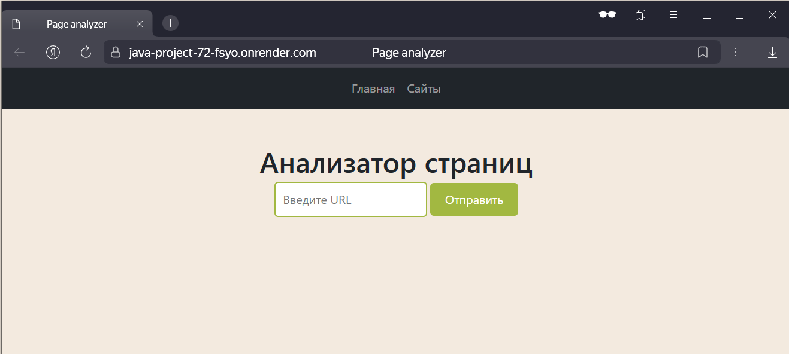
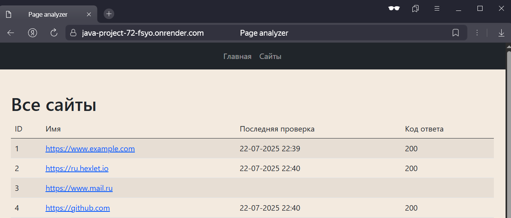
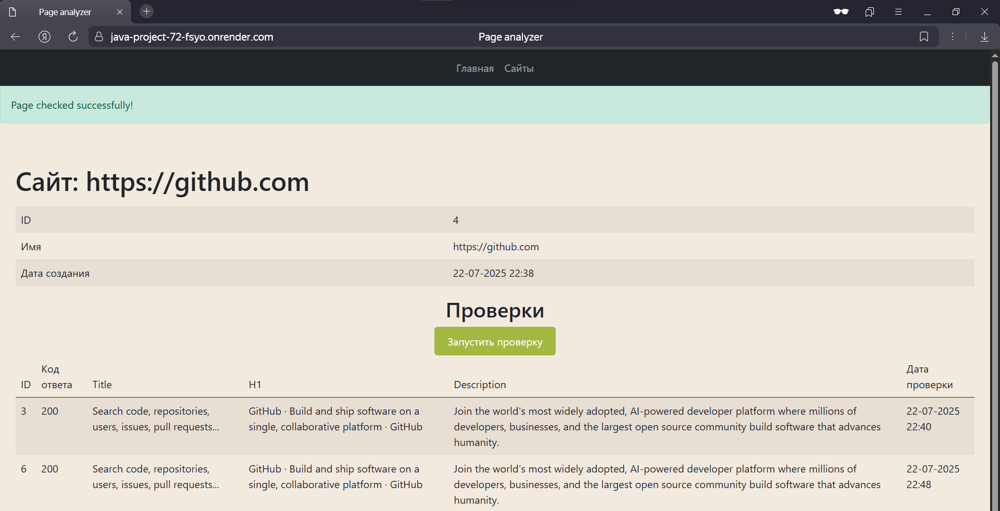

### Hexlet tests and linter status:

### Page Analyzer
#### Приложение:
https://java-project-72-fsyo.onrender.com/

#### Инструмент для проверки базовых SEO-параметров веб-страниц.

- Анализирует HTTP-ответы (коды состояния, редиректы)
- Извлекает и валидирует ключевые теги: `<title>`, `<h1>`, `<meta name="description">`
- Результаты отображаются в сортируемой таблице
- Написан на Javalin (Java + JTE-шаблоны)

